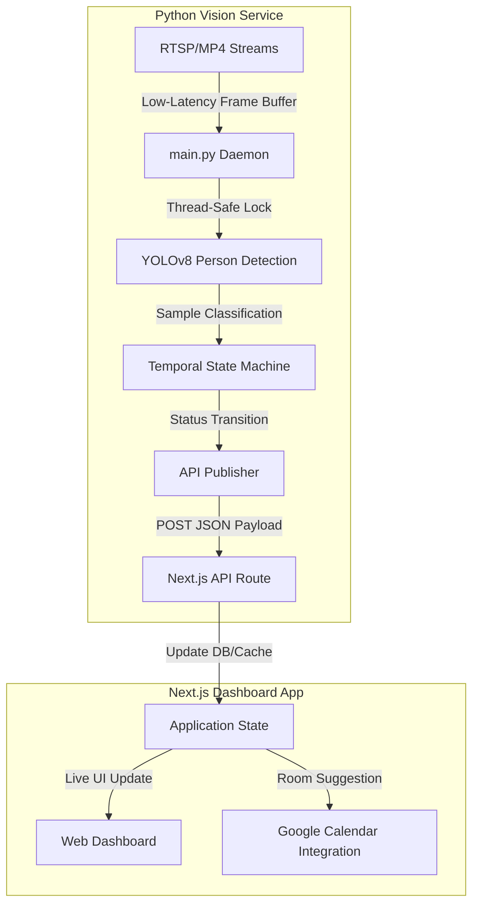

# 👁️ OccupEye — Real-Time Room Occupancy Tracking

OccupEye is an intelligent, privacy-first meeting room occupancy tracking system. It combines a lightweight Python-based computer vision service (running YOLOv8 person detection) with a Next.js web dashboard to provide real-time updates on room availability, temporal state smoothing, and calendar integrations.

---

## 🏗️ System Architecture



The system is split into two primary components:
1. **[Core (Python Vision Engine)](file:///home/daveydark/Documents/python/occupeye/core)**: Connects to camera streams, processes video frames, detects occupants, filters noise (temporal smoothing), and posts occupancy updates.
2. **[App (Next.js Web App)](file:///home/daveydark/Documents/python/occupeye/app)**: Serves the management dashboard, exposes the HTTP receiver API endpoint, maps stream URLs to room metadata, and handles smart scheduling.

---

## 🔒 Privacy-First Design

OccupEye is designed with strict privacy standards:
* **No Video/Image Storage**: Raw video feeds and captured images are processed entirely in local volatile memory.
* **Metadata Only**: The vision engine never uploads or logs visual data. Only anonymous JSON payloads containing room status (`occupied: true/false`), room stream URLs, and timestamp headers are transmitted to the dashboard.

---

## 🚦 Quick Start

### 1. Run the Python Vision Service (`core`)

Ensure you have **Python 3.12+** and **uv** installed.

```bash
# Navigate to the core service directory
cd core

# Install dependencies and create a virtual environment
uv sync

# Configure your camera streams and API endpoint in config.json
# (A template is provided in core/config.json)

# Run the multi-threaded occupancy tracking daemon
uv run python main.py
```

*For detailed configuration, diagnostics, and CLI tracking options, refer to the [Core README](file:///home/daveydark/Documents/python/occupeye/core/README.md).*

### 2. Run the Next.js Dashboard (`app`)

Ensure you have **Node.js 18+** installed.

```bash
# Navigate to the next.js dashboard directory
cd app

# Install dependencies
npm install

# Start the local development server
npm run dev
```

*Open [http://localhost:3000](http://localhost:3000) in your browser to view the live dashboard.*

---

## 📡 API Payload Schema

The Python service updates the Next.js app via a simple JSON POST payload sent to the API endpoint (configured in `config.json`'s `api_url`):

```json
{
  "room-url": "rtsp://your-cctv-stream-url:1935/app/stream1",
  "occupied": true,
  "timestamp": "2026-05-23T00:37:48Z"
}
```

---

## 🛠️ Components Directory

* **/core**: Contains the Python tracking code, model loaders, state transition filters, and local stream simulation tools.
* **/app**: Contains the Next.js dashboard app, UI components, database/caching state, and calendar integrations.
